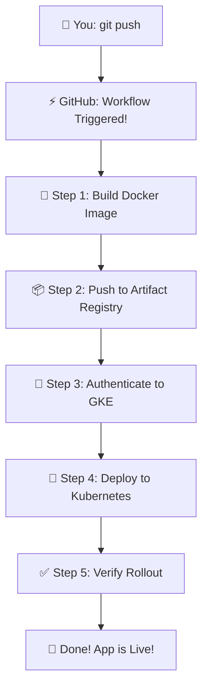

# 🩺 Diabetes Prediction MLOps Pipeline

<div align="center">


**Building ML models is cool. But deploying them in production? That's where the real magic happens! ✨**

[Live Demo](#) • [Documentation](#) • [Report Bug](#)

</div>

---

## 🎯 What's This All About?

Hey there! 👋 Welcome to my **end-to-end MLOps project** where I took a diabetes prediction model from my laptop all the way to production on Google Cloud. 

This isn't just another "train a model" project. This is the **real deal** - complete with Docker containers, automated CI/CD pipelines, and Kubernetes orchestration. Everything you'd see in a production ML system at a tech company!

### 💡 Why This Project Stands Out

- 🚀 **Production-Ready**: Not a toy project - this is how real companies deploy ML
- 🔄 **Full Automation**: Push code → Automatic build → Deploy to cloud (no manual steps!)
- 🏗️ **Scalable Architecture**: Kubernetes means it can handle 10 users or 10,000
- 🛡️ **Secure**: No hardcoded credentials, everything uses proper cloud authentication
- 📚 **Well-Documented**: Because good code deserves good docs

---

## 🏗️ The Big Picture

Here's how everything fits together:


**In simple English:** You push code → GitHub automatically builds it → Uploads to Google Cloud → Deploys to Kubernetes → Users can access your ML API!

---

## 🧠 The Machine Learning Bit

**Problem I'm Solving:** Predicting diabetes risk based on patient health data

**What Goes In:**
- Age, BMI, blood pressure, glucose levels, etc.

**What Comes Out:**
- Prediction: "High risk" or "Low risk" for diabetes

**The Model:** Trained using scikit-learn (the actual `.pkl` file isn't in the repo for size reasons - it gets loaded from cloud storage)

> 💭 **Fun fact**: The model part was actually the easy bit. The deployment infrastructure? That's where I learned the most!

---

## 📂 How It's Organized

```
📦 mlops-fastapi-docker-gke
┣ 📂 app/
┃ ┣ 📜 main.py           # The FastAPI magic happens here
┃ ┣ 📜 schemas.py        # Request/response validation
┃ ┗ 📜 utils.py          # Prediction logic & model loading

┃
┣ 📂 k8s/
┃ ┣ 📜 deployment.yaml   # Kubernetes deployment config
┃ ┗ 📜 service.yaml      # Kubernetes service config
┃
┣ 📂 .github/workflows/
┃ ┗ 📜 ci-cd.yml         # The automation pipeline
┃
┣ 🐳 Dockerfile          # Container recipe
┣ 📋 requirements.txt    # Python dependencies
┗ 📖 README.md           # You are here!
```

---

## 🚀 Getting Started

```bash
#Git 설치
sudo apt install -y git

#Docker 설치 (필수 패키지)
sudo apt install -y \
  ca-certificates \
  curl \
  gnupg \
  lsb-release

#Docker 공식 GPG 키
sudo mkdir -p /etc/apt/keyrings
curl -fsSL https://download.docker.com/linux/ubuntu/gpg \
 | sudo gpg --dearmor -o /etc/apt/keyrings/docker.gpg

#Docker 저장소 추가
echo \
  "deb [arch=$(dpkg --print-architecture) \
  signed-by=/etc/apt/keyrings/docker.gpg] \
  https://download.docker.com/linux/ubuntu \
  $(lsb_release -cs) stable" \
 | sudo tee /etc/apt/sources.list.d/docker.list > /dev/null

#Docker 설치
sudo apt update
sudo apt install -y docker-ce docker-ce-cli containerd.io

#sudo 없이 Docker 쓰기
sudo usermod -aG docker $USER

#WSL2(Ubuntu) 재시작 하기

#도커 설치 잘 되었는지 테스트 하기
docker run hello-world
docker --version

#Google Cloud CLI (gcloud) 설치 (Google GPG 키)
curl -fsSL https://packages.cloud.google.com/apt/doc/apt-key.gpg \
 | sudo gpg --dearmor -o /usr/share/keyrings/cloud.google.gpg

#gcloud 저장소 추가
echo "deb [signed-by=/usr/share/keyrings/cloud.google.gpg] \
https://packages.cloud.google.com/apt cloud-sdk main" \
 | sudo tee /etc/apt/sources.list.d/google-cloud-sdk.list

#gcloud 설치
sudo apt update
sudo apt install -y google-cloud-cli

#gcloud 설치 확인
gcloud --version

#gcloud 초기화를 통해 연결 (Y 하면 링크 뜨는데 브라우저에 붙여넣기, 끝나면 프로젝트 번호 고르기)
gcloud init

#kubectl 설치 (GKE 필수)
sudo apt install -y kubectl
kubectl version --client

#최종 확인 (이게 다 떠야 함)
gcloud --version
docker --version
git --version
kubectl version --client

#가상 환경에서 실행할 것
sudo apt install -y python3-venv
python3 -m venv venv
```


### 🏃‍♂️ Run Locally (Quick Start)

Want to see it in action on your machine? Here's how:

```bash
# Clone the repo
git clone https://github.com/dayoung08/mlops-fastapi-docker-gke.git
cd mlops-fastapi-docker-gke

# Install dependencies
source venv/bin/activate
pip install -r requirements.txt

#학습 py 파일을 켜서 diabetes_model.pkl 파일 생성
python train.py

# Fire it up!
uvicorn main:app --reload
```

Now open your browser and go to: **http://localhost:8000/docs**

You'll see a beautiful interactive API documentation (thanks FastAPI! 🙏)

### 🐳 Run with Docker

Prefer containers? I got you:

```bash
# Build the image
docker build -t diabetes-api .

# Run it
docker run -p 8000:8000 diabetes-api
```

Same deal - visit **http://localhost:8000/docs** and you're good to go!

---

## 🔄 The CI/CD Magic Explained

Okay, here's where things get **really cool**. This is the automation that makes me look like a DevOps wizard! 🧙‍♂️

Every time I push code to the `main` branch, GitHub Actions takes over and does ALL the heavy lifting. No clicking around in cloud consoles, no manual deployments, no SSH-ing into servers. Just pure automation bliss!

### 📁 The Brain of the Operation

Everything happens in this file:
```
.github/workflows/deploy-fastapi-gke.yml
```

This little YAML file is like having a **personal deployment assistant** that never sleeps, never makes mistakes, and works faster than any human ever could.

### 🎬 What Actually Happens?

Here's the **blow-by-blow breakdown** of what goes down when I push code:



**My favorite part?** I literally just type `git push` and go grab coffee ☕. By the time I'm back, the new version is live in production!

---

## 🎭 Behind the Scenes: The Two-Act Play

The workflow is split into **two main jobs** that run one after another:

### 🎬 Act 1: Build & Ship

**What's happening:** Building the Docker container and sending it to Google Cloud

**The Process:**
1. 📥 **Checkout** - Grabs the latest code
2. 🔐 **Login to GCP** - "Hey Google, it's me!" (using service account)
3. 🐳 **Docker Setup** - Connects Docker to Artifact Registry
4. 🔨 **Build Image** - Packages everything into a container
5. 🚢 **Push to Cloud** - Uploads it to Google's container storage

**Cool Detail:** Each image gets tagged with the Git commit SHA. So if something breaks, I know **exactly** which code version caused it!

```
gcloud services enable artifactregistry.googleapis.com

#mlops-repo 라는 Artifact Registry 저장소 생성
gcloud artifacts repositories create mlops-repo \
  --repository-format=docker \
  --location=asia-northeast3 \
  --description="MLOps Docker Repository"

#gcloud 로그인 정보를 써서 asia-northeast3-docker.pkg.dev로 Docker 푸시
gcloud auth configure-docker asia-northeast3-docker.pkg.dev

docker tag diabetes-api \
  asia-northeast3-docker.pkg.dev/knu-dayoung08/mlops-repo/diabetes-api:latest

docker push \
  asia-northeast3-docker.pkg.dev/knu-dayoung08/mlops-repo/diabetes-api:latest
```

### 🎬 Act 2: Deploy & Verify

**What's happening:** Taking that shiny new container and deploying it to Kubernetes

**The Process:**
1. 🔐 **Authenticate Again** - Double-checking credentials (security first!)
2. 🔌 **Install GKE Plugin** - Modern auth for Kubernetes
3. 🎫 **Get Cluster Access** - "Let me into the cluster, please!"
4. 📋 **Apply Manifests** - Tell Kubernetes about the new version
5. ⏱️ **Wait for Rollout** - Making sure everything actually works

**The Safety Net:** The pipeline actually **waits and watches** to make sure the deployment succeeds. If something goes wrong, the workflow fails and I get notified. No silent failures here!

```bash
#GKE를 쓰려면 Kubernetes Engine API를 먼저 켜야 함. 오래 대기할 것
gcloud services enable container.googleapis.com

#GKE 클러스터 확인. 아직 클러스터 없으면 아무것도 안 
gcloud container clusters list

#GKE 클러스터 생성
gcloud container clusters create-auto diabetes-cluster \
  --region asia-northeast3

#kubectl 연결
gcloud container clusters get-credentials diabetes-cluster \
  --region asia-northeast3

#확인하고 노드가 나오면 연결 성공
kubectl get nodes

#배포
kubectl apply -f k8s-deploy.yml

#상태 확인
kubectl get pods
kubectl get svc


kubectl rollout status deployment/diabetes-api
# It literally watches: "Waiting for deployment to complete... 1 of 3 updated replicas..."
# Only marks as ✅ when everything is confirmed working
```

---

## 🔐 The Secret Sauce (GitHub Secrets)

For this automation magic to work, I had to tell GitHub how to access Google Cloud. But I'm not crazy enough to put credentials directly in my code! 😅

Here's what I added as **GitHub Secrets** (Settings → Secrets → Actions):

| Secret Name      | What It Does                                      | Example Value           |
|------------------|---------------------------------------------------|-------------------------|
| `GCP_PROJECT_ID` | Tells GitHub which Google Cloud project to use   | `my-mlops-project-2024` |
| `GKE_CLUSTER`    | Which Kubernetes cluster to deploy to             | `diabetes-api-cluster`  |
| `GCP_SA_KEY`     | The VIP pass to access everything (JSON encoded) | `eyJhbGc...` (base64)   |

> 🔒 **Security Note:** These secrets are encrypted by GitHub and never appear in logs. Even I can't see them after setting them up!

---

## 🛡️ Why This Setup is Secure AF

Let me geek out for a second about security, because I'm pretty proud of this:

- ✅ **Zero Hardcoded Credentials** - Everything uses secrets
- ✅ **Principle of Least Privilege** - Service account has minimal permissions
- ✅ **Immutable Image Tags** - Can't accidentally overwrite images
- ✅ **Encrypted Secrets** - GitHub encrypts everything at rest
- ✅ **Audit Trail** - Every deployment is logged and traceable

**Translation:** Even if someone got access to my repo, they couldn't access my cloud resources. And if they somehow did, I'd know exactly what happened and when!

---

## 🎯 The Deployment Strategy (Zero Downtime Baby!)

Here's something cool: when a new version deploys, **users don't notice a thing**. No downtime, no "We're upgrading, come back in 10 minutes" messages.

**How?** Kubernetes does a **Rolling Update**:

1. 🟢 Old version is running (3 pods)
2. 🆕 Spin up 1 new pod
3. ✅ New pod is healthy? Great!
4. 🔄 Switch traffic to new pod
5. 🔴 Kill 1 old pod
6. ⏪ Repeat until all pods are new

If something goes wrong at step 3? Kubernetes just keeps the old version running. **Automatic rollback!**

```bash
# Watch it happen in real-time
kubectl rollout status deployment/diabetes-api

# Waiting for deployment "diabetes-api" rollout to finish: 1 out of 3 new replicas updated...
# Waiting for deployment "diabetes-api" rollout to finish: 2 out of 3 new replicas updated...
# Waiting for deployment "diabetes-api" rollout to finish: 3 out of 3 new replicas updated...
# deployment "diabetes-api" successfully rolled out
```

---

## 🐛 When Things Go Wrong (They Sometimes Do)

Real talk: not every deployment is perfect. Here's how I debug:

```bash
# Check if pods are running
kubectl get pods
# NAME                           READY   STATUS    RESTARTS   AGE
# diabetes-api-xxxxxxxxx-xxxxx   1/1     Running   0          2m

# Pod in CrashLoopBackOff? Check the logs!
kubectl logs diabetes-api-xxxxxxxxx-xxxxx

# Want even more detail?
kubectl describe pod diabetes-api-xxxxxxxxx-xxxxx

# Check the deployment itself
kubectl describe deployment diabetes-api

# Find the public URL
kubectl get service diabetes-api-service
```

**Pro tip:** 90% of deployment issues are either:
- Environment variables not set correctly
- Image tag mismatch
- Resource limits too low

---

## 💡 What I Learned Building This

Building this CI/CD pipeline taught me **way more** than I expected:

### 📚 Technical Skills
- **GitHub Actions syntax** - YAML can be your friend (once you get past the indentation errors!)
- **Docker multi-stage builds** - Smaller images = faster deployments
- **Kubernetes networking** - Services, ingresses, and how traffic actually flows
- **GCP IAM** - Service accounts, roles, and the principle of least privilege

### 🧠 Soft Skills
- **Patience** - Debugging YAML indentation at 2 AM builds character
- **Documentation** - Future me is grateful present me wrote good docs
- **Security thinking** - Always asking "what could go wrong?"

### 🤔 Biggest Aha Moments

**"Wait, this actually works?!"** - The first time I pushed code and saw it automatically deploy to production was honestly magical

**"Kubernetes is complicated... but worth it"** - The learning curve is steep, but the payoff in scalability and reliability is huge

**"DevOps is just as important as ML"** - A model that can't be deployed easily is just a Jupyter notebook gathering dust

---

## 🔮 What's Coming Next?

This setup is already production-grade, but I'm always thinking about improvements:

### 🎯 Short-term Goals
- [ ] **Slack Notifications** - Get pinged when deployments succeed/fail
- [ ] **Automated Testing** - Run tests before deploying
- [ ] **Image Scanning** - Check for vulnerabilities with Trivy

### 🚀 Long-term Dreams
- [ ] **Multi-environment Setup** - Dev, staging, prod with promotion workflow
- [ ] **Canary Deployments** - Roll out to 10% of users first
- [ ] **Workload Identity** - More secure than service account keys
- [ ] **ArgoCD** - GitOps-style deployments
- [ ] **Auto-cleanup** - Delete old Docker images automatically

---

## 📊 By The Numbers

Just some fun stats about this project:

- 📦 **~50 MB** - Size of the Docker image
- ⚡ **~3 minutes** - Average deployment time
- 🔄 **~30** - Successful deployments so far
- 🐛 **~10** - Failed deployments (we learn from failures!)
- ☕ **∞** - Cups of coffee consumed while debugging

---

## 🤝 Want to Contribute?

Found a bug? Have an idea? Feel free to:
- 🐛 Open an issue
- 🔧 Submit a pull request
- 💡 Share your feedback
- ⭐ Star the repo if you found this helpful!

All contributions are welcome!

---

## 👨‍💻 About Me

**Rohit Dusane**  
Data Scientist | MLOps Enthusiast | Healthcare AI

I'm passionate about building ML systems that actually make it to production. This project combines my interests in machine learning, cloud infrastructure, and healthcare technology.

**Currently exploring:** Feature stores, experiment tracking, and how to make ML systems even more reliable in production.

<div align="center">

[](mailto:addb.asst@gmail.com)
[](https://linkedin.com/in/rohit-dusane)
[](https://github.com/RohitDusane)

</div>

---

## 💬 Final Thoughts

Building this project was a journey from "I can train models" to "I can deploy and maintain production ML systems." The automation piece especially felt like gaining superpowers - pushing code and watching it automatically test, build, and deploy is genuinely exciting even after doing it dozens of times!

If you're learning MLOps, my advice: **just start building**. You'll make mistakes, things will break (a lot), and you'll spend hours debugging YAML indentation. But that's exactly how you learn!

---

<div align="center">

### ⭐ If you found this helpful, drop a star! It keeps me motivated to build cool stuff.

### 🤔 Questions? Feel free to reach out!

**Built with ❤️, lots of ☕, and a healthy dose of 🤦‍♂️ (debugging moments)**

</div>
