# 🩺 Diabetes Prediction MLOps Pipeline

<div align="center">


**Building ML models is cool. But deploying them in production? That's where the real magic happens! ✨**

[Live Demo](#) • [Documentation](#) • [Report Bug](#)

</div>

---

## 🎯 What's This All About?

Hey there! 👋 Welcome to my **end-to-end MLOps project** where I took a diabetes prediction model from my laptop all the way to production on Google Cloud. 

This isn't just another "train a model" project. This is the **real deal** - complete with Docker containers, automated CI/CD pipelines, and Kubernetes orchestration. Everything you'd see in a production ML system at a tech company!

### 💡 Why This Project Stands Out

- 🚀 **Production-Ready**: Not a toy project - this is how real companies deploy ML
- 🔄 **Full Automation**: Push code → Automatic build → Deploy to cloud (no manual steps!)
- 🏗️ **Scalable Architecture**: Kubernetes means it can handle 10 users or 10,000
- 🛡️ **Secure**: No hardcoded credentials, everything uses proper cloud authentication
- 📚 **Well-Documented**: Because good code deserves good docs

---

## 🏗️ The Big Picture

Here's how everything fits together:

```mermaid
graph LR
    A[👨‍💻 You Push Code] --> B[🔄 GitHub Actions]
    B --> C[🐳 Build Docker Image]
    C --> D[📦 GCP Artifact Registry]
    D --> E[☸️ Deploy to GKE]
    E --> F[🌐 Live FastAPI Service]
    F --> G[😊 Happy Users]
```



**In simple English:** You push code → GitHub automatically builds it → Uploads to Google Cloud → Deploys to Kubernetes → Users can access your ML API!

---

## 🧠 The Machine Learning Bit

**Problem I'm Solving:** Predicting diabetes risk based on patient health data

**What Goes In:**
- Age, BMI, blood pressure, glucose levels, etc.

**What Comes Out:**
- Prediction: "High risk" or "Low risk" for diabetes

**The Model:** Trained using scikit-learn (the actual `.pkl` file isn't in the repo for size reasons - it gets loaded from cloud storage)

> 💭 **Fun fact**: The model part was actually the easy bit. The deployment infrastructure? That's where I learned the most!

---

## 📂 How It's Organized

```
📦 diabetes-mlops-pipeline
┣ 📂 app/
┃ ┣ 📜 main.py           # The FastAPI magic happens here
┃ ┣ 📜 schemas.py        # Request/response validation
┃ ┗ 📜 utils.py          # Prediction logic & model loading
┃
┣ 📂 k8s/
┃ ┣ 📜 deployment.yaml   # Kubernetes deployment config
┃ ┗ 📜 service.yaml      # Kubernetes service config
┃
┣ 📂 .github/workflows/
┃ ┗ 📜 ci-cd.yml         # The automation pipeline
┃
┣ 🐳 Dockerfile          # Container recipe
┣ 📋 requirements.txt    # Python dependencies
┗ 📖 README.md           # You are here!
```

---

## 🚀 Getting Started

### 🏃‍♂️ Run Locally (Quick Start)

Want to see it in action on your machine? Here's how:

```bash
# Clone the repo
git clone https://github.com/yourusername/diabetes-mlops-pipeline.git
cd diabetes-mlops-pipeline

# Install dependencies
pip install -r requirements.txt

# Fire it up!
uvicorn app.main:app --reload
```

Now open your browser and go to: **http://localhost:8000/docs**

You'll see a beautiful interactive API documentation (thanks FastAPI! 🙏)

### 🐳 Run with Docker

Prefer containers? I got you:

```bash
# Build the image
docker build -t diabetes-api .

# Run it
docker run -p 8000:8000 diabetes-api
```

Same deal - visit **http://localhost:8000/docs** and you're good to go!

---

## 🔄 The CI/CD Magic

Every time I push code to the `main` branch, here's what happens automatically:

1. ✅ **GitHub Actions kicks in** - "New code? Let me handle this!"
2. 🔐 **Authenticates with Google Cloud** - Using secure service account keys
3. 🐳 **Builds a fresh Docker image** - With all the latest changes
4. 📤 **Pushes to Artifact Registry** - Google's container storage
5. ☸️ **Updates Kubernetes deployment** - Rolling update, zero downtime
6. 🎉 **Done!** - New version is live in production

**Translation:** I just push code and everything else happens automatically. That's the dream! ☁️

### 🔑 Secrets You'll Need

Add these to your GitHub repo secrets (Settings → Secrets → Actions):

| Secret             | What It Is                                          |
|--------------------|-----------------------------------------------------|
| `GCP_PROJECT_ID`   | Your Google Cloud project ID                        |
| `GCP_REGION`       | Where you want to deploy (e.g., `us-central1`)      |
| `GCP_CLUSTER_NAME` | Name of your GKE cluster                            |
| `GCP_SA_KEY`       | Service account JSON (encoded in base64)            |

---

## ☁️ Google Cloud Setup

### What I'm Using

- **🗄️ Artifact Registry** - Stores my Docker images
- **☸️ GKE (Google Kubernetes Engine)** - Runs my containers at scale
- **🔐 IAM & Service Accounts** - Secure access management

### Deploy to Kubernetes

Once your cluster is set up, deployment is just:

```bash
# Deploy the app
kubectl apply -f k8s/deployment.yaml

# Expose it to the world
kubectl apply -f k8s/service.yaml

# Check if it's running
kubectl get pods

# See your service
kubectl get services
```

---

## 🛡️ Security First

I take security seriously. Here's what I did:

- ❌ **No hardcoded credentials** - Everything uses secrets
- ❌ **No sensitive data in Git** - Model files and configs are external
- ✅ **GitHub Secrets** - For all authentication
- ✅ **Service Account** - Minimal permissions, no root access
- ✅ **Containerized** - Isolated runtime environment

---

## 📈 What I Learned Building This

This project taught me **way more** than just training models:

- 🐳 **Docker** - How to containerize Python apps properly
- ☸️ **Kubernetes** - Container orchestration at scale
- 🔄 **CI/CD** - Automating the entire deployment pipeline
- ☁️ **Google Cloud** - Working with real cloud infrastructure
- 🔐 **Security** - Proper secrets management and IAM
- 📊 **Production ML** - What it actually takes to deploy models

**Biggest Lesson:** MLOps is just as important as the ML itself. A great model that's hard to deploy is less useful than a good model that's easy to deploy!

---

## 🔮 What's Next?

This project is already production-ready, but here's what I want to add:

- [ ] 📊 **MLflow Integration** - Track experiments and model versions
- [ ] 🎯 **A/B Testing** - Compare model versions in production
- [ ] 📈 **Monitoring Dashboard** - Prometheus + Grafana for metrics
- [ ] 🔄 **Automated Retraining** - When model performance drops
- [ ] 🧪 **Feature Store** - Centralized feature management
- [ ] 🚦 **Canary Deployments** - Safer rollouts

---

## 🤝 Want to Contribute?

Found a bug? Have an idea? Feel free to:
- 🐛 Open an issue
- 🔧 Submit a pull request
- 💡 Share your feedback

All contributions are welcome!

---

## 👨‍💻 About Me

**Rohit Dusane**  
Data Scientist | MLOps Enthusiast | Healthcare AI

I'm passionate about building ML systems that actually make it to production. This project combines my interests in machine learning, cloud infrastructure, and healthcare technology.

<div align="center">

[](mailto:addb.asst@gmail.com)
[](https://linkedin.com/in/rohit-dusane)
[](https://github.com/RohitDusane)

</div>

---

<div align="center">

### ⭐ If you found this helpful, drop a star! It keeps me motivated to build cool stuff.

**Built with ❤️ and lots of ☕**

</div>